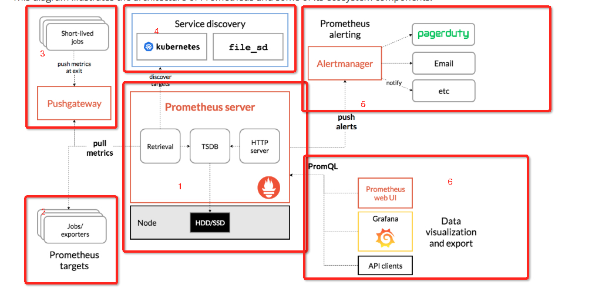
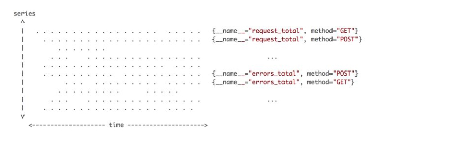

## Prometheus核心概念理解总结


主要记录监控模块Prometheus 的总结和自身的理解。


##  官方架构理解





从官网找到的架构图， 我们简单总结下Prometheus有以下特点：


1. 采用`pull`模型， 从制定targets拉取数据， 而不是我们常用的`push` 上报数据

2. 为了兼容不支持`pull`模型的情况， 引入`Pushgateway`模块，变向支持push上报数据
3. Prometheus server采用TSDB(时序数据模型)存储最终数据， 数据落地到HDD/SSD
4. 支持服务发现， 主动发现k8s要pull的对象
5. 支持报警模块
6. 提供PromSQL表达式语言， 支持通过Prometheus, Grafana 等进行报表展示和数据导出


#### 关键点0, 存储结构



Prometheus与其他主流时序数据库一样，在数据模型定义上，也会包含metric name、一个或多个labels（同tags）以及metric value。metric name加一组labels作为唯一标识，来定义time series，也就是时间线。在查询时，支持根据labels条件查找time series，支持简单的条件也支持复杂的条件。存储引擎的设计，会根据时序数据的特点，重点考虑数据存储（写多读少）、数据回收（retention）以及数据查询，Prometheus这里暂时还没提数据分析。


上图是所有数据点分布的一个简单视图，横轴是时间，纵轴是时间线，区域内每个点就是数据点。Prometheus每次接收数据，收到的是图中区域内纵向的一条线。这个表述很形象，因为在同一时刻，每条时间线只会产生一个数据点，但同时会有多条时间线产生数据，把这些数据点连在一起，就是一条竖线


####  关键点1， 上报数据结构


数据类型如下：

##### Counter：

只增不减， incr, 应用场景，比如累计注册人数

##### Gauge：

可以设置任何值， 不会

##### Histogram：

将数据指定规到几个桶中， 即将数据分类， 比如： 这里(-5,0,5)实际划分成了几种桶：<=-5，<=0，<=5，<=无穷大。

*histogram*，是柱状图，在Prometheus系统中的查询语言中，有三种作用：

1. 对每个采样点进行统计，打到各个分类值中(bucket)
2. 对每个采样点值累计和(sum)
3. 对采样点的次数累计和(count)

度量指标名称: `[basename]`的柱状图, 上面三类的作用度量指标名称

- [basename]_bucket{le=“上边界”}, 这个值为小于等于上边界的所有采样点数量
- [basename]_sum： 总和
- [basename]_count： 总次数

##### Summary：

类似Histogram， 计算主要在客户端进行


常见的数据结构

```
# HELP python_gc_collected_objects Objects collected during gc =======>文档描述
# TYPE python_gc_collected_objects histogram ================> 描述
python_gc_collected_objects_bucket{generation="0",le="500.0"} 2.0 ======>具体信息
python_gc_collected_objects_bucket{generation="0",le="1000.0"} 2.0
python_gc_collected_objects_bucket{generation="0",le="5000.0"} 2.0
python_gc_collected_objects_bucket{generation="0",le="10000.0"} 2.0
python_gc_collected_objects_bucket{generation="0",le="50000.0"} 2.0
python_gc_collected_objects_bucket{generation="0",le="+Inf"} 2.0
python_gc_collected_objects_count{generation="0"} 2.0
python_gc_collected_objects_sum{generation="0"} 0.0
```


### 关键点3, PromSQL


Prometheus提供函数表达式语言， 用来帮助用户实时的选择聚合时序数据， 表达式结果可以在图表上展示。


表达式的语言类型有如下：

1. Instant vector:  在同一时间点，一组不同时序数据的集合，结合关键点0理解, 即横轴不变的一组点。大部分函数查询基于该类型向量查询

2. Range vector:  每个时序序列， 再一定时间范围内的数据点集合，结合关键点0理解,即纵轴不变的一组点， 

3. Scalar: 标量，简单的数字类型数据

4. String: 字符串数据，暂时未用到


##### 匹配模式详解

向量与向量之间进行运算操作时会基于默认的匹配规则：依次找到与左边向量元素匹配（标签完全一致）的右边向量元素进行运算，如果没找到匹配元素，则直接丢弃。

支持 1对1，1对多，多对1，三种匹配模式。 不支持多对多。


一对一匹配模式会从操作符两边表达式获取的瞬时向量依次比较并找到唯一匹配(标签完全一致)的样本值。默认情况下，使用表达式：


```
vector1 <operator> vector2
```

在操作符两边表达式标签不一致的情况下，可以使用on(label list)或者ignoring(label list）来修改便签的匹配行为。使用ignoreing可以在匹配时忽略某些便签。而on则用于将匹配行为限定在某些便签之内。


```
<vector expr> <bin-op> ignoring(<label list>) <vector expr>
<vector expr> <bin-op> on(<label list>) <vector expr>
```


多对一和一对多两种匹配模式指的是“一”侧的每一个向量元素可以与"多"侧的多个元素匹配的情况。在这种情况下，必须使用group修饰符：group_left或者group_right来确定哪一个向量具有更高的基数（充当“多”的角色）。


具体参考： https://yunlzheng.gitbook.io/prometheus-book/parti-prometheus-ji-chu/promql/prometheus-promql-operators-v2


### 关键点4，服务发现

对于Prometheus这一类基于Pull模式的监控系统，显然也无法继续使用的static_configs的方式静态的定义监控目标。而对于Prometheus而言其解决方案就是引入一个中间的代理人（服务注册中心SD(service discovery），这个代理人掌握着当前所有监控目标的访问信息，Prometheus只需要向这个代理人询问有哪些监控目标控即可， 这种模式被称为服务发现。如图, 


在Kubernetes这类容器管理平台中，Kubernetes掌握并管理着所有的容器以及服务信息，那此时Prometheus只需要与Kubernetes打交道就可以找到所有需要监控的容器以及服务对象。


