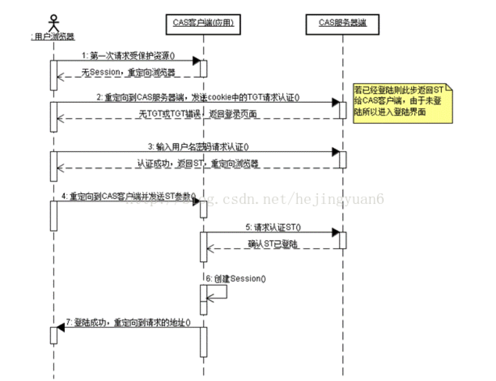
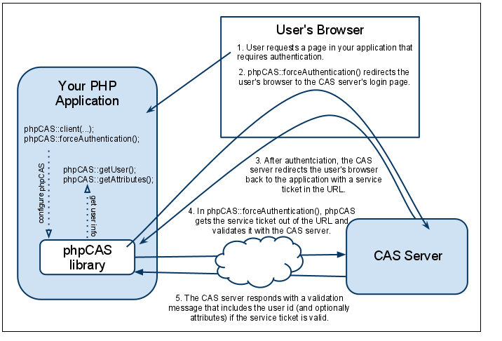

### cas单点登录 client端核心理解

0. 用户带着session请求应用server

1. 应用server检查是否有 session:user_info map信息(这里可以存储redis)

2. 应用server得出没有map信息， 则跳转用户跳转到cas client单点登录， 登录成功，回调应用接口， url参数中带着票据ticket

3. 应用server没有map信息， 但是有ticket, 则请求cas-server, 拿着ticket换取用户信息， 并且声称session:user_info map信息

4. 本地有map信息，并且有ticket  则继续采用server获取的原有map信息(这里默认无法覆盖原有map信息)， 拿到对应user_info, 用户属性

5. 根据拿到的信息, 请求rabc接口校验是否有相关权限

相关时序图:

官网流程图:

官网教程:

https://apereo.atlassian.net/wiki/spaces/CASC/pages/103252665/phpCAS+examples#phpCASexamples-Onlycheckauthentication(gateway)  

php类库

https://apereo.atlassian.net/wiki/spaces/CASC/pages/103252665/phpCAS+examples#phpCASexamples-Onlycheckauthentication(gateway)
