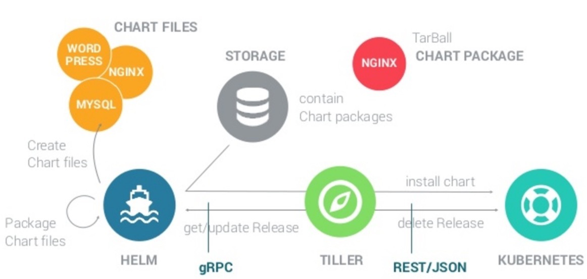

## k8s包管理工具Helm调研

Helm通过软件打包的形式，支持发布的版本管理和控制来操作k8s的应用, 类似于apt-get/ yum工具

Helm把Kubernetes资源(比如deployments、services或 ingress等) 打包到一个chart中，而chart被保存到chart仓库。通过chart仓库可用来存储和分享chart。Helm使发布可配置，支持发布应用配置的版本管理，简化了Kubernetes部署应用的版本控制、打包、发布、删除、更新等操作。

### helm概念

Helm主要包括两个组件`Helm Client` 和`The Tiller Server`, 我们分别介绍


####  Helm Client

是为用户提供的命令行工具， 主要用于

* 本地chart操作
* 管理chart仓库地址
* 与Tiller server 进行相关：
  - 将chart文件推到Tiller 用于安装
  - 请求`releases`信息(这里即安装的应用包信息)
  - 更新或者卸载已经存在的软件包

#### Tiller Server

是安装在k8s集群里面， 与`Helm Client` `k8s apiserver`进行通信， 主要

* 接收处理`Helm Client`请求
* 处理chart ,构建`release`(k8s可读的配置文件)
* 安装charts到k8s, 并且可以检索最新的发布历史
* 和`k8s apiserver`通信， 更新和卸载charts


#### 实现方式

Helm Client主要是用golang实现， 通过gRPC和Tiller server进行通信

Tiller server 也主要是用golang实现， 其存储的源信息都放到k8s的`ConfigMaps`资源中， 自己没有独立的数据库


#### 交互图解




### 安装

#### 安装`helm client`

```shell
#github上下载二进制文件 https://github.com/helm/helm/releases
wget https://storage.googleapis.com/kubernetes-helm/helm-v2.12.2-linux-amd64.tar.gz

#解压
tar -zxvf helm-v2.12.2-linux-amd64.tar.gz

mv linux-amd64/helm /usr/local/bin/helm

验证安装成功
helm -h 

```

#### 安装 `Tiller server`

主要通过Helm Client进行来安装

安装命令

```
helm init --debug
```

输出如下

```
---
apiVersion: extensions/v1beta1
kind: Deployment
metadata:
  creationTimestamp: null
  labels:
    app: helm
    name: tiller
  name: tiller-deploy
  namespace: kube-system
spec:
  replicas: 1
  strategy: {}
  template:
    metadata:
      creationTimestamp: null
      labels:
        app: helm
        name: tiller
    spec:
      automountServiceAccountToken: true
      containers:
      - env:
        - name: TILLER_NAMESPACE
          value: kube-system
        - name: TILLER_HISTORY_MAX
          value: "0"
        image: gcr.io/kubernetes-helm/tiller:v2.12.2
        imagePullPolicy: IfNotPresent
        livenessProbe:
          httpGet:
            path: /liveness
            port: 44135
          initialDelaySeconds: 1
          timeoutSeconds: 1
        name: tiller
        ports:
        - containerPort: 44134
          name: tiller
        - containerPort: 44135
          name: http
        readinessProbe:
          httpGet:
            path: /readiness
            port: 44135
          initialDelaySeconds: 1
          timeoutSeconds: 1
        resources: {}
status: {}

---
apiVersion: v1
kind: Service
metadata:
  creationTimestamp: null
  labels:
    app: helm
    name: tiller
  name: tiller-deploy
  namespace: kube-system
spec:
  ports:
  - name: tiller
    port: 44134
    targetPort: tiller
  selector:
    app: helm
    name: tiller
  type: ClusterIP
status:
  loadBalancer: {}
```


我们可以看到， helm init自动会帮我们部署一个deployment, service, 并将Tiller Server 安装到集群中， 因为镜像是在gcr.io， 已经被墙， 我们可以指定阿里云镜像，重新部署, 依赖安装的是v2.12.2, 因此阿里云镜像地址也要指定该特定版本号.

我们执行命令

```
helm init --upgrade -i registry.cn-hangzhou.aliyuncs.com/google_containers/tiller:v2.12.2
```


还需要需要给tiller 建立对应的serviceaccount(参考：https://github.com/helm/helm/issues/3055)

```
kubectl create serviceaccount --namespace kube-system tiller
kubectl create clusterrolebinding tiller-cluster-rule --clusterrole=cluster-admin --serviceaccount=kube-system:tiller

kubectl patch deploy --namespace kube-system tiller-deploy -p '{"spec":{"template":{"spec":{"serviceAccount":"tiller"}}}}'

或者helm init时 指定serviceaccount
helm init --service-account tiller
```


通过kubectl 验证

```
kubectl get svc -n kube-system
kubectl get pods -n kube-system

能看到我们的已经安装的Tiller
```

增加aliyun的chart仓库

```
helm repo add aliyun https://kubernetes.oss-cn-hangzhou.aliyuncs.com/charts

#列出仓库列表
helm repo list
#列出所有仓库chart
helm search
```


### 常用命令


#### 创建chart

```
helm create chart-demo

```

会自动新建chart-demo目录，我们进入chart-demo可以看下目录结构

```
|- .helmignore        # Contains patterns to ignore when packaging Helm charts.
|
|- Chart.yaml         # chart基础信息
|
|- templates/         # deployment service等模版信息
|
|- values.yaml        # 对应模版加载的数据信息
|
|- charts/            # Chart 依赖的其他charts信息
|
|- templates/tests/   # The test files
|
|- LICENSE            # 【可选】文本文件，关于chart的证书相关信息
|
|- requirements.yaml  # 【可选】列出依赖的 chart信息
|
|- README.md    #【可选】 具有可读性的描述信息
```

我们通过查看values.yaml文件，查看我们默认是安装的`nginx`服务， 可以看到 有定义我们的image, service， ingress类型。

```
# Default values for chart-demo.
# This is a YAML-formatted file.
# Declare variables to be passed into your templates.

replicaCount: 1

image:
  repository: nginx ===========这里是默认安装nginx镜像
  tag: stable
  pullPolicy: IfNotPresent

nameOverride: ""
fullnameOverride: ""

service:
  type: ClusterIP
  port: 80

ingress:
  enabled: false
  annotations: {}
    # kubernetes.io/ingress.class: nginx
    # kubernetes.io/tls-acme: "true"
  paths: []
  hosts:
    - chart-example.local
  tls: []
  #  - secretName: chart-example-tls
  #    hosts:
  #      - chart-example.local

resources: {}
  # We usually recommend not to specify default resources and to leave this as a conscious
  # choice for the user. This also increases chances charts run on environments with little
  # resources, such as Minikube. If you do want to specify resources, uncomment the following
  # lines, adjust them as necessary, and remove the curly braces after 'resources:'.
  # limits:
  #  cpu: 100m
  #  memory: 128Mi
  # requests:
  #  cpu: 100m
  #  memory: 128Mi

nodeSelector: {}

tolerations: []

affinity: {}
```

我们进入templates目录， 查看目录列表

```
lt@node01:~/chart-demo/templates$ ls
NOTES.txt  _helpers.tpl  deployment.yaml  ingress.yaml  service.yaml  tests
```

打开deployment.yaml， 可以看到模版框架, 这里有引入golang的模版语言， 可以自动加载value.yaml， chart.yaml中预定义的值

```
lt@node01:~/chart-demo/templates$ cat deployment.yaml
apiVersion: apps/v1
kind: Deployment
metadata:
  name: {{ include "chart-demo.fullname" . }}
  labels:
    app.kubernetes.io/name: {{ include "chart-demo.name" . }}
    helm.sh/chart: {{ include "chart-demo.chart" . }}
    app.kubernetes.io/instance: {{ .Release.Name }}
    app.kubernetes.io/managed-by: {{ .Release.Service }}
spec:
  replicas: {{ .Values.replicaCount }}
  selector:
    matchLabels:
      app.kubernetes.io/name: {{ include "chart-demo.name" . }}
      app.kubernetes.io/instance: {{ .Release.Name }}
  template:
    metadata:
      labels:
        app.kubernetes.io/name: {{ include "chart-demo.name" . }}
        app.kubernetes.io/instance: {{ .Release.Name }}
    spec:
      containers:
        - name: {{ .Chart.Name }}
          image: "{{ .Values.image.repository }}:{{ .Values.image.tag }}"
          imagePullPolicy: {{ .Values.image.pullPolicy }}
          ports:
            - name: http
              containerPort: 80
              protocol: TCP
          livenessProbe:
            httpGet:
              path: /
              port: http
          readinessProbe:
            httpGet:
              path: /
              port: http
          resources:
            {{- toYaml .Values.resources | nindent 12 }}
      {{- with .Values.nodeSelector }}
      nodeSelector:
        {{- toYaml . | nindent 8 }}
      {{- end }}
    {{- with .Values.affinity }}
      affinity:
        {{- toYaml . | nindent 8 }}
    {{- end }}
    {{- with .Values.tolerations }}
      tolerations:
        {{- toYaml . | nindent 8 }}
    {{- end }}
```

然后我们可以看下Chart.yaml文件， 这里面主要存储chart的描述信息

```
apiVersion: v1
appVersion: "1.0"
description: A Helm chart for Kubernetes
name: chart-demo
version: 0.1.0
```
如果依赖其他chart信息， 可以新建requirements.yaml文件，列出依赖哪些chart， 如下例子

requirements.yaml

```
dependencies:
    - name: kibana
      version: "0.2.2"
      repository: "@aliyun"  #这里是指定采用哪个仓库
```
执行命令，将依赖的chart下载到charts目录

```
helm dep up
```

```
lt@node01:~/chart-demo$ helm dep up
Hang tight while we grab the latest from your chart repositories...
...Unable to get an update from the "local" chart repository (http://127.0.0.1:8879/charts):
	Get http://127.0.0.1:8879/charts/index.yaml: dial tcp 127.0.0.1:8879: connect: connection refused
...Successfully got an update from the "aliyun" chart repository
...Successfully got an update from the "stable" chart repository
Update Complete. ⎈Happy Helming!⎈
Saving 1 charts
Downloading kibana from repo https://kubernetes.oss-cn-hangzhou.aliyuncs.com/charts
Deleting outdated charts
```
我们进入charts目录进行确认

```
lt@node01:~/chart-demo$ cd charts/
lt@node01:~/chart-demo/charts$ ls
kibana-0.2.2.tgz
```


#### 安装chart到k8s集群

```
helm install ./chart-demo/

#还可以直接指定远端仓库的chart的方式， 这里不细说， 例如
helm install stable/stash

```

输出如下： 

```
lt@node01:~$ helm install ./chart-demo/
NAME:   dangling-waterbuffalo
LAST DEPLOYED: Wed Jan 16 17:14:56 2019
NAMESPACE: default
STATUS: DEPLOYED

RESOURCES:
==> v1/Service
NAME                              TYPE       CLUSTER-IP     EXTERNAL-IP  PORT(S)  AGE
dangling-waterbuffalo-kibana      ClusterIP  10.102.122.38  <none>       443/TCP  1s
dangling-waterbuffalo-chart-demo  ClusterIP  10.97.130.203  <none>       80/TCP   1s

==> v1beta1/Deployment
NAME                          DESIRED  CURRENT  UP-TO-DATE  AVAILABLE  AGE
dangling-waterbuffalo-kibana  1        1        1           0          1s

==> v1/Deployment
NAME                              DESIRED  CURRENT  UP-TO-DATE  AVAILABLE  AGE
dangling-waterbuffalo-chart-demo  1        1        1           0          1s

==> v1/Pod(related)
NAME                                               READY  STATUS             RESTARTS  AGE
dangling-waterbuffalo-kibana-75c55d4f7d-hfzhf      0/1    ContainerCreating  0         1s
dangling-waterbuffalo-chart-demo-5f947f74f6-2glp7  0/1    ContainerCreating  0         1s


NOTES:
1. Get the application URL by running these commands:
  export POD_NAME=$(kubectl get pods --namespace default -l "app.kubernetes.io/name=chart-demo,app.kubernetes.io/instance=dangling-waterbuffalo" -o jsonpath="{.items[0].metadata.name}")
  echo "Visit http://127.0.0.1:8080 to use your application"
  kubectl port-forward $POD_NAME 8080:80
```

#### 查看已经安装的release信息

```
helm list

lt@node01:~$ helm list
NAME         	REVISION	UPDATED                 	STATUS  	CHART           	APP VERSION	NAMESPACE
left-elephant	1       	Wed Jan 16 17:15:44 2019	DEPLOYED	chart-demo-0.1.0	1.0        	default

#可以通过kubectl 查看对应的service, deployment详细安装信息
kubectl get svc
kubectl get deployment

```

#### 更新已经安装的软件包

主要通过helm upgrade命令，
现在我们需要给我们已经release的应用 left-elephant， 增加环境变量, 变动如下

values.yaml

```
containers:
  my_env_value: "Hello helm"
```

deployment.yaml

```
env:
- name: MY_ENV_VALUE
  value: "{{ .Values.containers.my_env_value }}"
```

执行安装

```
helm upgrade --install left-elephant chart-demo/
```

我们进入到对应的nginx pod中， 验证变量名是否生效

```
lt@node01:~$ kubectl exec -it left-elephant-chart-demo-79f9984c64-j9x8n bash
root@left-elephant-chart-demo-79f9984c64-j9x8n:/# echo $MY_ENV_VALUE
Hello helm
```


#### 删除对应已经安装的release

```
 helm delete left-elephant
```

#### 可以列出release记录， 即使已经删除的release

```
helm history  left-elephant

lt@node01:~$ helm history  left-elephant
REVISION	UPDATED                 	STATUS  	CHART           	DESCRIPTION
1       	Wed Jan 16 17:15:44 2019	DEPLOYED	chart-demo-0.1.0	Install complete
```

#### 回滚到指定的release

helm rollback [flags] [RELEASE] [REVISION]

```
lt@node01:~$ helm rollback left-elephant 1
Rollback was a success! Happy Helming!

#然后我们可以验证下 
lt@node01:~$ helm list
NAME         	REVISION	UPDATED                 	STATUS  	CHART           	APP VERSION	NAMESPACE
left-elephant	2       	Wed Jan 16 17:22:37 2019	DEPLOYED	chart-demo-0.1.0	1.0        	default
```

#### 打包

我们可以将新建的chart打包.tgz压缩文件， 可以将其推到我们的私有仓库

```
helm package chart-demo/
```

```
lt@node01:~$ helm package chart-demo/
Successfully packaged chart and saved it to: /home/lt/chart-demo-0.1.0.tgz
```

#### 验证语法是否报错

```
lt@node01:~$ helm lint chart-demo
==> Linting chart-demo
[INFO] Chart.yaml: icon is recommended

1 chart(s) linted, no failures
```

#### 发布过程中的hook操作

这里没有做最终测试，发布过程中，可以在特定点执行特定操作， 格式如下

```
apiVersion: ...
kind: ....
metadata:
  annotations:
    "helm.sh/hook": "pre-install"
```

这块没有做实践


### 总结

Helm项目提供了一个统一软件打包方式，支持版本控制，可以大大简化Kubernetes应用分发与部署中的复杂性
 , 对于部署我们复杂应用，有参考应用， 比如值和模版分离，版本等使用
 
 
### 参考文章

https://docs.helm.sh/developing_charts/#charts

https://www.kubernetes.org.cn/2726.html

https://zhuanlan.zhihu.com/p/33813367

